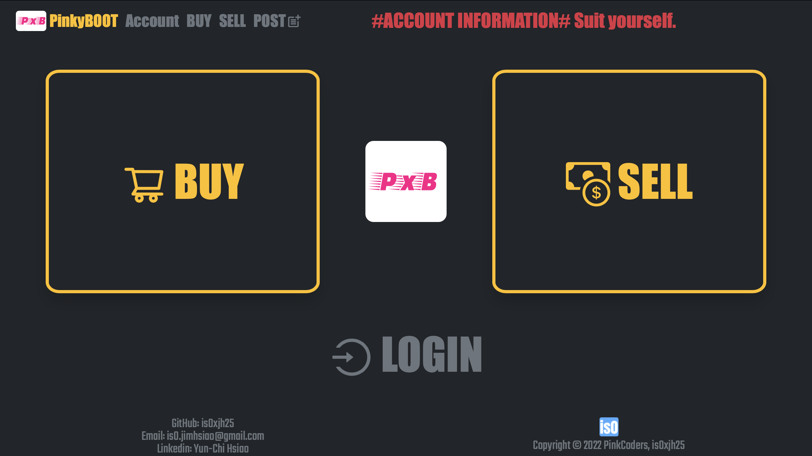
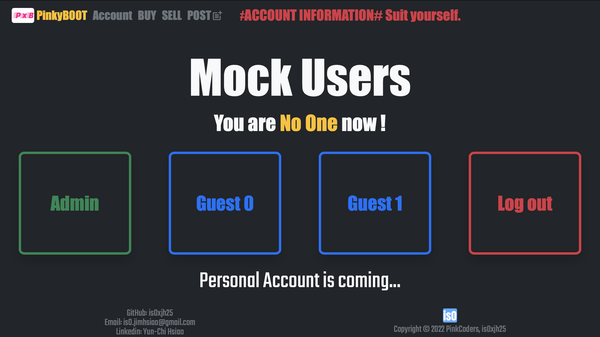
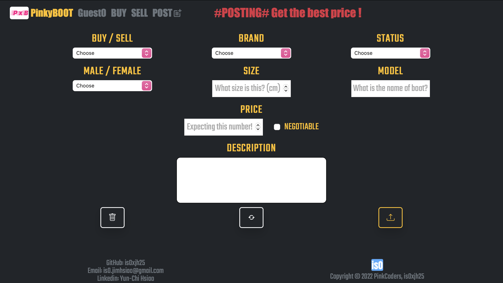

# PinkyBoot

  

## Table of Content
* [About the Application](#about-the-application)
* [Getting Started](#getting-started)
* [Usage](#usage)
* [Demo](#demo)
* [Developed by](#developed-by)

## About the Application
This is a mock application for shoes trading and it has selling and buying pages. The users can add, edit and delete thier own posts, and leave their contact details for further trading. It will be hosted on server and be published for the public in the future.   

## Getting Started
- Install node_modules via package.json
  > Type in terminal: `npm install`
- Initialize the json-server and start the live-server
  > Type in terminal: `npm start`
- Potential errors and warning
  - "concurrently not found..."
  > Type in terminal: `npm install concurrently`
  - "Module not found: Can't resolve '@mui/material/ClickAwayListener'..."
  > Type in terminal: `npm install notistack@latest-mui-v4`
  - Please use Safari/Firefox browser. Chrome will be supported recently. 
  
## Usage
- **Pages**
  - **Home**
  - **Account**
  - **Buy**
  - **Sell**
  - **Add Post**
- **Functionalities**
  - **Switch user**
  - **New post**
  - **Edit**
  - **Delete**
  - **Star**
  - **Unstar**
  
## Demo  
- **Home**

  

  

- **Account**

  

- **Post**

  

- **Create a Post**

  

- **Update a Post**

  

- **Delete a Post**

  

- **Star and Unstar a Post**

  

- **Authority Level**

  

## Developed by
- The application is developed by _[is0xjh25 (Yun-Chi Hsiao)](https://is0xjh25.github.io)_ 
 

  
